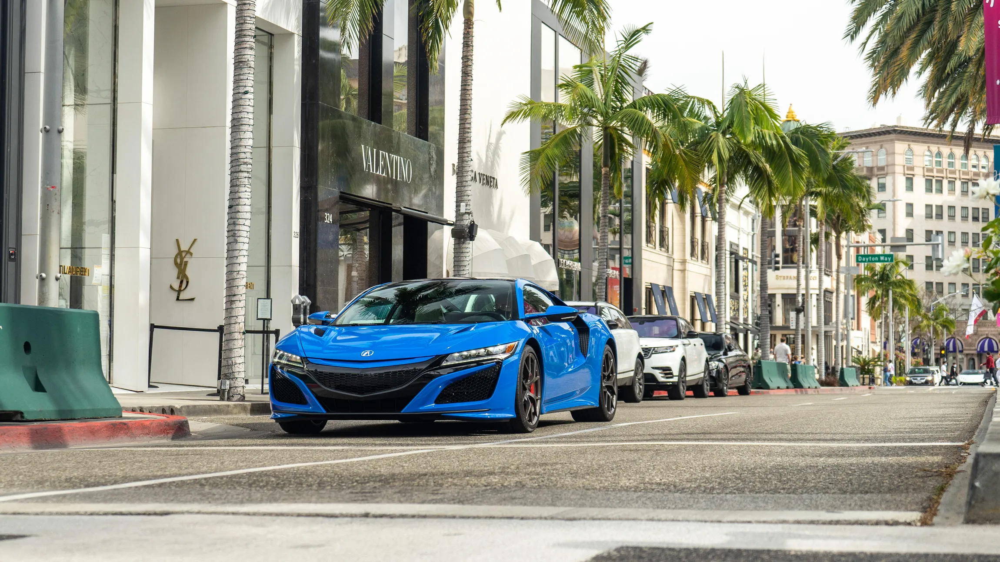

# Car_price
# Car Price Analysis Project



## Overview
This project focuses on analyzing car prices using a dataset that includes various attributes such as brand, model, year, engine size, fuel type, transmission, mileage, doors, owner count, and price. The analysis was performed using SQL and Tableau for data visualization.

## Files in the Repository
- **`car_price_dataset.xlsx`**: The main dataset containing car price data.
- **`SQL.SQL`**: SQL queries used for analyzing the dataset.
- **`image.png`**: A screenshot showcasing the project folder and file details.

## Tableau Dashboard
The dataset has been visualized using **Tableau**, providing insights into car price trends, brand-wise price distribution, and other important aspects. You can explore the interactive Tableau dashboard at the following link:

**[Tableau Dashboard Link]([ADD_YOUR_TABLEAU_LINK_HERE](https://public.tableau.com/app/profile/mina.wahba/viz/Car_price_17417461472280/Dashboard1))**

## SQL Analysis
The dataset was analyzed using SQL queries to extract valuable insights. Below are the key SQL queries used and their explanations:

### 1. Extracting Average Car Price by Year
```sql
SELECT Year, AVG(Price) AS Avg_Price
FROM car_price_dataset
GROUP BY Year
ORDER BY Year;
```
**Explanation:** This query calculates the average price of cars for each manufacturing year, helping us understand price trends over time.

### 2. Finding the Most Common Car Brands
```sql
SELECT Brand, COUNT(*) AS Car_Count
FROM car_price_dataset
GROUP BY Brand
ORDER BY Car_Count DESC;
```
**Explanation:** This query retrieves the most frequently listed car brands in the dataset.

### 3. Analyzing Price Distribution by Fuel Type
```sql
SELECT Fuel_Type, AVG(Price) AS Avg_Price, COUNT(*) AS Car_Count
FROM car_price_dataset
GROUP BY Fuel_Type
ORDER BY Avg_Price DESC;
```
**Explanation:** This query calculates the average price of cars for each fuel type and counts the number of listings, allowing comparison between fuel types.

### 4. Mileage vs. Price Correlation
```sql
SELECT Mileage, Price
FROM car_price_dataset
ORDER BY Mileage;
```
**Explanation:** This query retrieves the mileage and price of each car, which is useful for creating scatter plots to analyze depreciation trends.

### 5. Number of Cars by Transmission Type
```sql
SELECT Transmission, COUNT(*) AS Car_Count
FROM car_price_dataset
GROUP BY Transmission
ORDER BY Car_Count DESC;
```
**Explanation:** This query identifies how many cars are available with each transmission type.

### 6. Average Price by Engine Size
```sql
SELECT Engine_Size, AVG(Price) AS Avg_Price
FROM car_price_dataset
GROUP BY Engine_Size
ORDER BY Engine_Size;
```
**Explanation:** This query analyzes whether larger engine sizes correlate with higher car prices.

### 7. Cars Count by Year
```sql
SELECT Year, COUNT(*) AS Car_Count
FROM car_price_dataset
GROUP BY Year
ORDER BY Year;
```
**Explanation:** This query helps understand how many cars are available from each model year.

### 8. Most Expensive Cars
```sql
SELECT Brand, Model, Year, Price
FROM car_price_dataset
ORDER BY Price DESC
LIMIT 10;
```
**Explanation:** This query retrieves the **top 10 most expensive cars** in the dataset.

### 9. Cheapest Cars
```sql
SELECT Brand, Model, Year, Price
FROM car_price_dataset
ORDER BY Price ASC
LIMIT 10;
```
**Explanation:** This query retrieves the **top 10 cheapest cars** in the dataset.

### 10. Price Range by Brand
```sql
SELECT Brand, MIN(Price) AS Min_Price, MAX(Price) AS Max_Price
FROM car_price_dataset
GROUP BY Brand
ORDER BY Max_Price DESC;
```
**Explanation:** This query determines the price range (min & max) for each car brand.

## Key Insights
1. **Price Trends Over the Years**: The average car price has shown a steady increase over time.
2. **Brand-wise Price Comparison**: Different brands exhibit variations in pricing, with premium brands showing higher average prices.
3. **Fuel Type Impact**: Electric and hybrid cars tend to have a higher price range compared to petrol and diesel vehicles.
4. **Engine Size vs. Price**: Generally, larger engine sizes correlate with higher car prices.
5. **Ownership & Price Correlation**: The number of previous owners influences the car's resale value.

## How to Use This Repository
1. **SQL Analysis**:
   - Run the queries in `SQL.SQL` using PostgreSQL or any other SQL-supported database tool.
2. **Data Visualization**:
   - Open the Tableau dashboard (link above) to explore interactive insights.
3. **Dataset Exploration**:
   - Use `car_price_dataset.xlsx` to analyze the raw data further in Excel or Python.

## Project Screenshot


## Download SQL File
📥 **[Download SQL File](sandbox:/mnt/data/SQL.SQL)**

## Requirements
- **Database Management System** (PostgreSQL, MySQL, or any SQL-based tool)
- **Tableau Public/Desktop** for visualization
- **Python (optional)** for further data analysis

## Contact
If you have any questions or need further assistance, feel free to reach out.

---
**Author:** Mina Wahba  
**Date:** March 2025

